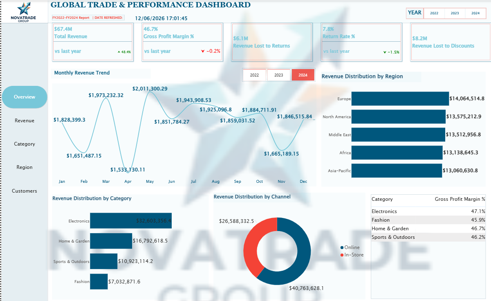
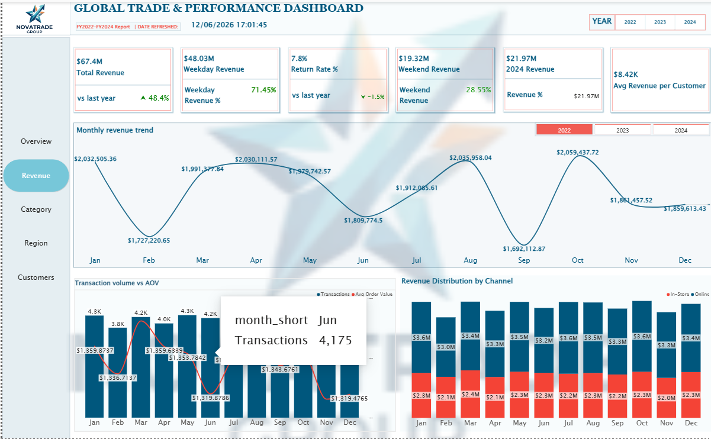
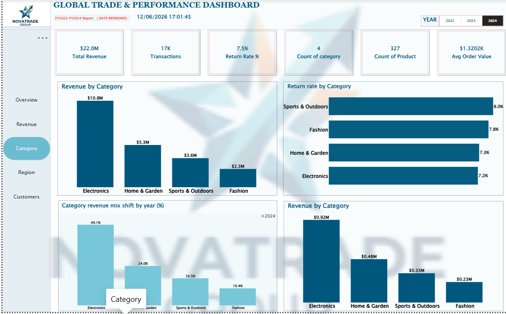
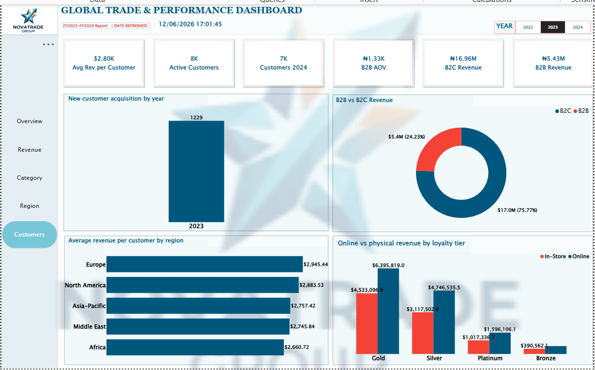
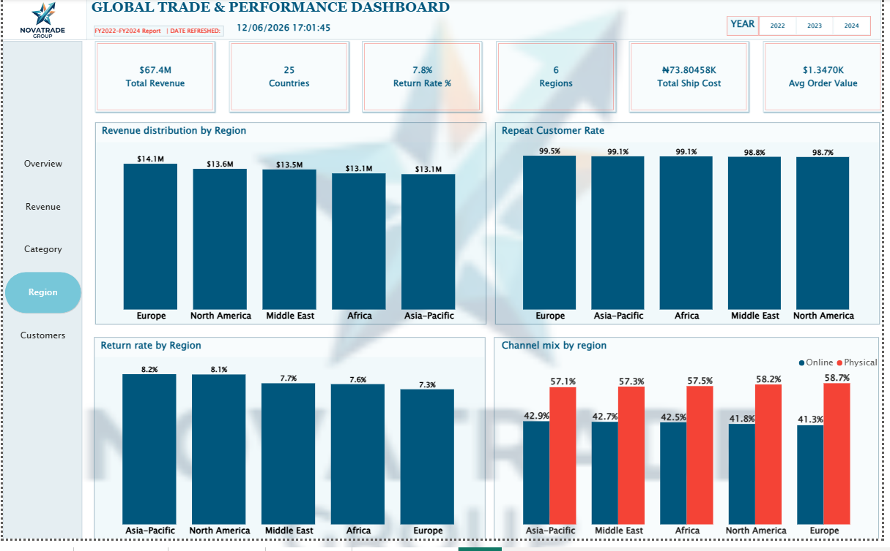

# BI Dashboard

To set up this dashboard, you will have to connect the dataset from postgresql.

### Report Objective

1. Which regions/categories deserve more investment or exit review?
2. What is customer value across segments, regions, and loyalty tiers?
3. Where are returns concentrated and what do they cost?
4. What does YoY analysis reveal about growth and seasonality?

**Data sources:** Sales (POS, ~50K transactions), Products (PIM, 327 SKUs), Customers (CRM, 8,000 records), Stores (148 physical + online), Budget (Finance ERP). Modelled via dbt into a star schema before loading into Power BI.

---

## 2. Report Structure

Five pages, persistent left-nav, Year slicer (2022/23/24) on every page: **Overview · Revenue · Category · Region · Customers**

---

## 3. Page Summary

| Page          | Key KPIs                                                                                                    | Key Visuals                                                                                         |
| ------------- | ----------------------------------------------------------------------------------------------------------- | --------------------------------------------------------------------------------------------------- |
| **Overview**  | Total Revenue $67.4M · GP Margin 46.7% · Return Rate 7.8% · Revenue Lost to Returns $6.1M / Discounts $8.2M | Monthly trend, revenue by region/category/channel, category margin table                            |
| **Revenue**   | Weekday Rev $48.0M (71.5%) · Weekend Rev $19.3M (28.5%) · 2024 Rev $21.97M                                  | Monthly trend, transaction volume vs AOV, channel split by month                                    |
| **Category**  | Revenue $22.0M · 17K transactions · 4 categories, 327 products                                              | Revenue & return rate by category, category mix shift by year                                       |
| **Region**    | 25 countries, 6 regions · Return rate 7.8%                                                                  | Revenue by region, repeat customer rate, return rate by region, channel mix by region               |
| **Customers** | Active customers 8K · B2C $17.0M (76%) vs B2B $5.4M (24%)                                                   | New customer acquisition, B2B vs B2C split, avg revenue/customer by region, channel by loyalty tier |

---

## Dashbaords

#### Overview

#### Revenue

#### Category

#### Customers

#### Region

---

## 4. Known Issues to Fix Before Board Review

1. **Total Revenue "vs last year ▲48.4%"** — comparing a 3-year cumulative figure against a prior-year measure that has no valid comparison. Remove or replace with a single-year card.
2. **Currency mismatch** — Total Ship Cost, B2B AOV, B2C/B2B Revenue show ₦ (Naira) instead of $. Check format settings on those four measures.
3. **Customer count conflict** — "Customers 2024" (7K) vs "Active Customers" (8K) — confirm both use the same filter logic.
4. **New Customer Acquisition chart** — only 2023 is rendering; 2022 and 2024 bars are missing.
5. **Avg Rev per Customer mismatch** — $2.80K on Customers page vs $8.42K on Revenue page; likely different filter context, needs reconciling or relabeling.
6. **Repeat Customer Rate at 98–99%** — implausibly high; likely counting rows instead of distinct purchase periods.

---

## 5. Tech Stack

dbt (staging → intermediate → marts) → Power BI Desktop.
