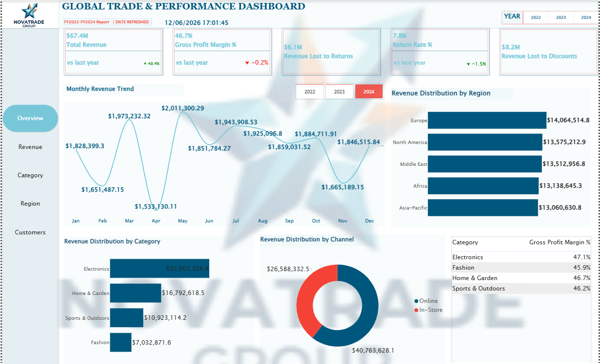

# NovaTrade Group — Analytics Engineering Pipeline

## Navigation

---

Quickly move to the session you want.

- [Overview](#overview)
- [Project Objective](#project-objective)
- [Pipeline Overview](#pipeline-overview)
- [Project Structure](#project-structure)
- [Architecture Flow](#architecture-flow)
- [How It Works](#how-it-works)
- [Source Dataset](#source-dataset)
- [Technologies](#technologies)
- [Setup Instructions](#setup-instructions)
- [Dashboard](#dashboard)

## Overview

This project transforms raw transactional, customer, product, store, and budget data from NovaTrade Group's three source systems into a clean, tested, analysis-ready star schema using dbt. The output feeds a Power BI reporting layer (Global Trade & Performance Dashboard) covering Revenue Performance, Category & Region, Customer Intelligence, and Operations.

NovaTrade Group is a multinational retail conglomerate operating across five regions (Europe, North America, Middle East, Africa, Asia-Pacific) and one online channel (NovaTrade Direct), selling across four categories (Electronics, Fashion, Home & Garden, Sports & Outdoors) spanning three pricing tiers (Budget, Mid-Market, Premium).

Data coverage: January 2022 – December 2024 · 50,000 transactions · 8,000 customers · 327 products · 116 stores (115 physical + 1 online) · 720 monthly budget records

---

## Project Objective

This pipeline extracts raw data from local storage, converts it to the Parquet format, loads it into a relational database, and transforms it into analytics-ready models using dbt.

---

## Pipeline Overview

| Step | Stage         | Description                                                     |
| ---- | ------------- | --------------------------------------------------------------- |
| 1    | **Extract**   | Read raw CSV files from local storage                           |
| 2    | **Convert**   | Serialize data to Parquet format for efficient columnar storage |
| 3    | **Load**      | Ingest Parquet files into the target database                   |
| 4    | **Transform** | Apply business logic and cleaning rules via dbt                 |
| 5    | **Model**     | Produce staging, intermediate, and mart dbt models              |
| 6    | **Reporting** | Create Power BI reports                                         |

---

## Project Structure

```
nova_analytics/
│
├── BI Report/
│   └── NTG.pbix                          # Power BI report file
│
├── data/
│   └── parquet/                          # Raw source data files
│       ├── NTG_Customers.parquet
│       ├── NTG_Products.parquet
│       ├── NTG_Sales.parquet
│       └── NTG_Stores.parquet
│
├── pipeline/
│   ├── config.py
│   ├── convert.py
│   ├── extract.py
│   ├── load.py
│   └── main.py
│
├── novatrade/                            # dbt project root
│   ├── dbt_project.yml                   # dbt project configuration
│   │
│   ├── models/
│   │   ├── staging/                      # Source cleaning & casting
│   │   │   ├── sources.yml               # Source definitions + freshness
│   │   │   ├── properties.yml            # Staging model docs & tests
│   │   │   ├── stg_customers.sql
│   │   │   ├── stg_products.sql
│   │   │   ├── stg_sales.sql
│   │   │   └── stg_stores.sql
│   │   │
│   │   ├── intermediate/
│   │   │   ├── schema.yml
│   │   │   ├── int_customer.sql
│   │   │   ├── int_products.sql
│   │   │   └── int_sales.sql
│   │   │
│   │   └── marts/
│   │       ├── schema.yml
│   │       ├── fct_revenue.sql
│   │       ├── dim_customer_revenue.sql
│   │       ├── dim_date.sql
│   │       ├── dim_discount_impact.sql
│   │       ├── dim_returns.sql
│   │       └── dim_revenue_monthly.sql
│   │
│   ├── analyses/
│   │   └── customers/
│   │       └── customer_value_distribution.sql
│   │
│   ├── macros/
│   │   └── generate_schema_name.sql
│   │
│   ├── tests/
│   │   ├── assert_discount_range.sql
│   │   ├── cost_price_less_than_unit_price.sql
│   │   ├── customer_order_check.sql
│   │   └── no_negative_revenue.sql
│   │
│   ├── seeds/
│   └── snapshots/
│
├── logs/
│   └── dbt.log
├── pyproject.toml
└── .gitignore
```

## Architecture Flow

---

## Data Flow

The pipeline follows a particular pattern from source to BI reporting.

- **Extraction:** The data is extracted from the local machine using python-pandas library.
- **Conversion:** The files are then converted from CSV to Parquet, and then saved on the local machine.
- **Load:** Converted files are then loaded into Postgres as raw data.
- **Transformation:** dbt connects to the loaded data in Postgres for transformation and modeling.

#### Low-level DAG Pipeline Diagram


---

## How It Works

### dbt Modelling Layers

The dbt project follows a three-layer modelling architecture. Each layer has a distinct responsibility and feeds into the next.

```
raw (PostgreSQL)
     │
     ▼
 staging          # Clean, cast, and rename — 1:1 with raw tables
     │
     ▼
 intermediate     # Enrich and derive — business logic before final models
     │
     ▼
 marts            # Star schema — facts and dimensions ready for reporting
```

---

#### Staging — `models/staging/`

Materialised as **views**. One model per source table. No business logic — only cleaning, renaming, type casting, and deduplication. All column names are standardised to `snake_case` at this layer.

| Model           | Source Table        | Description                                                             |
| --------------- | ------------------- | ----------------------------------------------------------------------- |
| `stg_sales`     | `raw.ntg_sales`     | Transactions cleaned — types cast, nulls filtered, discount validated   |
| `stg_customers` | `raw.ntg_customers` | Customer records cleaned — name formatted, email lowercased, dates cast |
| `stg_products`  | `raw.ntg_products`  | Product catalogue cleaned — price and cost cast, category standardised  |
| `stg_stores`    | `raw.ntg_stores`    | Store records cleaned — region and store type standardised              |

Data quality tests defined in `properties.yml` cover uniqueness, not-null constraints, referential integrity, and accepted values across all staging models.

---

#### Intermediate — `models/intermediate/`

Materialised as **views**. Enriches staging models with derived fields and business logic before mart construction. These models exist to keep marts clean and focused.

| Model          | Description                                                                                                                  |
| -------------- | ---------------------------------------------------------------------------------------------------------------------------- |
| `int_sales`    | Joins `stg_sales` with product cost data; derives `gross_revenue`, `net_revenue`, `cogs`, and `gross_profit` per transaction |
| `int_customer` | Enriches `stg_customers` with `tenure_band` derived from `join_date` and a `channel_type` flag (Online vs. In-Store)         |
| `int_products` | Enriches `stg_products` with margin calculations and product tier classifications ready for dimension use                    |

---

#### Marts — `models/marts/`

Materialised as **tables**. The final analytics layer — a star schema consumed directly by Power BI. All business metrics are pre-computed here so the reporting layer performs no transformations.

| Model                  | Type      | Description                                                                          |
| ---------------------- | --------- | ------------------------------------------------------------------------------------ |
| `fct_revenue`          | Fact      | One row per transaction — revenue, COGS, gross profit, net profit, ship cost         |
| `dim_customer_revenue` | Dimension | Customer-level revenue summary — LTV, order count, avg order value, segment          |
| `dim_date`             | Dimension | Full date spine from 2022–2024 — year, quarter, month, week, weekend flag            |
| `dim_discount_impact`  | Dimension | Discount band analysis — revenue and margin impact by discount range                 |
| `dim_returns`          | Dimension | Return transactions — return rate, revenue lost, return reason by product and region |
| `dim_revenue_monthly`  | Dimension | Monthly revenue aggregated by region, category, and channel                          |

---

#### Custom Tests — `tests/`

In addition to generic dbt tests in `schema.yml`, four singular SQL tests enforce business rules that generic tests cannot cover:

| Test                                  | Description                                                |
| ------------------------------------- | ---------------------------------------------------------- |
| `assert_discount_range.sql`           | Fails if any discount falls outside the 0–1 range          |
| `cost_price_less_than_unit_price.sql` | Fails if cost price is greater than or equal to unit price |
| `customer_order_check.sql`            | Fails if any customer has no associated transactions       |
| `no_negative_revenue.sql`             | Fails if any transaction produces a negative revenue value |

Run all tests with:

```bash
dbt test
```

#### Macros — `macros/`

| Macro                      | Description                                                                                                                                           |
| -------------------------- | ----------------------------------------------------------------------------------------------------------------------------------------------------- |
| `generate_schema_name.sql` | Overrides dbt's default schema naming to use exact schema names (`staging`, `intermediate`, `marts`) instead of prefixed names like `dbt_dev_staging` |

---

## Source Dataset

Five CSV source files covering January 2022 to December 2024.

| File                | Rows   | Description                                                                                              |
| ------------------- | ------ | -------------------------------------------------------------------------------------------------------- |
| `NTG_Sales.csv`     | 50,000 | Transaction records — order date, product, store, quantity, unit price, discount, ship cost, return flag |
| `NTG_Customers.csv` | 8,000  | Customer master — name, email, segment, loyalty tier, region, join date, channel                         |
| `NTG_Products.csv`  | 327    | Product catalogue — category, sub-category, tier, unit price, cost price                                 |
| `NTG_Stores.csv`    | 116    | Store directory — store type, region, country (115 physical + 1 online)                                  |

All source files are read from the local machine path configured in `pipeline/config.py`.

---

## Tables by Layer

### Staging — `staging` schema

The staging layer mirrors each raw source table 1:1. Only cleaning, type casting, and column renaming — no business logic.

| Table           | Source              | Key Transformations                                                                                                               |
| --------------- | ------------------- | --------------------------------------------------------------------------------------------------------------------------------- |
| `stg_sales`     | `raw.ntg_sales`     | Cast IDs to varchar, dates to date, amounts to numeric(10,2); normalise discount percentage to 0–1 range; derive `is_return` flag |
| `stg_customers` | `raw.ntg_customers` | Cast IDs to varchar, dates to date; concatenate first/last name into `customer_name`; lowercase email                             |
| `stg_products`  | `raw.ntg_products`  | Cast IDs to varchar, amounts to numeric(10,2); standardise category names                                                         |
| `stg_stores`    | `raw.ntg_stores`    | Cast IDs to varchar, dates to date; map obfuscated city names to real city names per country                                      |

### Intermediate — `intermediate` schema

Enriches staging models with derived fields and cross-model joins. These views keep the marts layer clean.

| Table          | Purpose                                                                                                                                                                                                                         |
| -------------- | ------------------------------------------------------------------------------------------------------------------------------------------------------------------------------------------------------------------------------- |
| `int_sales`    | Joins `stg_sales` + `stg_products` + `stg_stores`; derives `revenue_gross`, `revenue_net`, `cogs`, `gross_profit`, `gross_profit_margin`, `discount_band`, `revenue_lost_to_discount`, `is_return`, `order_year`, `order_month` |
| `int_products` | Adds `tier_rank` (1–3) and `is_premium` flag                                                                                                                                                                                    |
| `int_customer` | Adds `tenure_band` and `channel_type` (Online vs In-Store)                                                                                                                                                                      |

### Marts — `marts` schema

The final analytics layer — star schema consumed by Power BI. All metrics pre-computed.

| Table                  | Type      | Grain                                                       |
| ---------------------- | --------- | ----------------------------------------------------------- |
| `fct_revenue`          | Fact      | One row per transaction                                     |
| `dim_customer_revenue` | Dimension | One row per customer with LTV, order count, avg order value |
| `dim_date`             | Dimension | One row per day (2022–2024)                                 |
| `dim_discount_impact`  | Dimension | Discount band analysis                                      |
| `dim_returns`          | Dimension | Return metrics by product and region                        |
| `dim_revenue_monthly`  | Dimension | Monthly aggregates by region, category                      |

## Technologies

| Tool             | Version | Purpose                                                      |
| ---------------- | ------- | ------------------------------------------------------------ |
| Python           | 3.13    | Pipeline orchestration — extraction, conversion, and loading |
| pandas           | latest  | CSV reading and DataFrame operations                         |
| PyArrow          | latest  | Parquet conversion and reading                               |
| SQLAlchemy       | latest  | Database engine and loading interface                        |
| psycopg2-binary  | latest  | PostgreSQL adapter                                           |
| PostgreSQL       | 15+     | Relational data warehouse — hosts raw and dbt schemas        |
| dbt-core         | 1.8.0   | Data transformation and modelling framework                  |
| dbt-postgres     | 1.8.0   | dbt adapter for PostgreSQL                                   |
| Power BI Desktop | latest  | Dashboard and reporting layer                                |

---

## How to Reproduce

### Prerequisites

Before starting, ensure the following tools are installed on your machine. Click the links for download instructions if needed.

| Tool                    | Minimum Version | Required For               | Install Guide                                          |
| ----------------------- | --------------- | -------------------------- | ------------------------------------------------------ |
| Python                  | 3.9             | Running the ETL pipeline   | [python.org](https://www.python.org/downloads/)        |
| PostgreSQL              | 15              | Data warehouse             | [postgresql.org](https://www.postgresql.org/download/) |
| dbt-core + dbt-postgres | 1.8             | Data transformation models | Installed via `pip` (step 4)                           |
| Power BI Desktop        | Latest          | Dashboard and reporting    | [Microsoft Store](https://aka.ms/pbidesktopstore)      |
| Git                     | Latest          | Cloning the repository     | [git-scm.com](https://git-scm.com/downloads)           |

Verify your installations:

```bash
python --version          # expected: Python 3.9+
psql --version            # expected: psql 15+
git --version             # expected: git 2.x+
```

---

### 1. Clone the repository

```bash
git clone https://github.com/Chibutechie/nova_analytics.git
cd nova_analytics
```

This creates a local copy of the project with the full directory structure shown in the [Project Structure](#project-structure) section.

---

### 2. Set up PostgreSQL

**Step A — Ensure PostgreSQL is running**

Check if the PostgreSQL service is active:

- **Windows:** Open Services (`services.msc`), look for `postgresql-x64-15`, and confirm its status is **Running**.
- **macOS / Linux:** Run `pg_isready` — if PostgreSQL is running it returns `localhost:5432 - accepting connections`.

**Step B — Create the target database**

```bash
psql -U postgres -c "CREATE DATABASE novatrade;"
```

You can verify the database was created:

```bash
psql -U postgres -d novatrade -c "\l" | findstr novatrade   # Windows
psql -U postgres -d novatrade -c "\l" | grep novatrade       # macOS / Linux
```

> No schemas or tables need to be created manually — the pipeline creates the `raw` schema automatically, and dbt creates the `staging`, `intermediate`, and `marts` schemas.

**Step C — Ensure your user can connect with a password**

If your PostgreSQL user requires a password, set it:

```sql
ALTER USER postgres PASSWORD 'your_password';
```

---

### 3. Create a Python virtual environment

Isolating dependencies prevents conflicts with other Python projects on your machine.

```bash
python -m venv .venv
```

Activate the environment:

| Platform             | Command                         |
| -------------------- | ------------------------------- |
| Windows (CMD)        | `.venv\Scripts\activate`        |
| Windows (PowerShell) | `.venv\Scripts\Activate.ps1`    |
| Windows (Git Bash)   | `source .venv/Scripts/activate` |
| macOS / Linux        | `source .venv/bin/activate`     |

After activation, your terminal prompt should show `(.venv)` at the beginning.

---

### 4. Install Python dependencies

```bash
pip install -r requirements.txt
```

This installs all packages listed below:

| Package           | Purpose                           |
| ----------------- | --------------------------------- |
| `pandas`          | Reading CSVs into DataFrames      |
| `pyarrow`         | Parquet conversion engine         |
| `sqlalchemy`      | Database connectivity             |
| `psycopg2-binary` | PostgreSQL adapter for SQLAlchemy |
| `python-dotenv`   | Loading `.env` credentials        |
| `dbt-core`        | Transformation framework          |
| `dbt-postgres`    | PostgreSQL adapter for dbt        |

Verify dbt is installed:

```bash
dbt --version
```

Expected output contains `dbt-core` and `dbt-postgres` with version numbers.

---

### 5. Prepare source CSV data

The pipeline expects four CSV files representing NovaTrade's source systems. You have two options:

**Option A — Use your own data (recommended)**

Place your CSV files in any folder on your local machine. The folder path will be configured in the next step.

| File                | Contents                                                                                                    | Rows   |
| ------------------- | ----------------------------------------------------------------------------------------------------------- | ------ |
| `NTG_Sales.csv`     | Transaction-level data — order date, product, store, quantity, unit price, discount, ship cost, return flag | 50,000 |
| `NTG_Customers.csv` | Customer master — name, email, segment, loyalty tier, region, join date, channel                            | 8,000  |
| `NTG_Products.csv`  | Product catalogue — product name, category, sub-category, brand, cost price, tier                           | 327    |
| `NTG_Stores.csv`    | Store directory — store name, type, country, region, square footage, manager                                | 116    |

**Option B — Generate synthetic data**

If you do not have access to the original CSV files, you can generate synthetic data using any data generation tool such as [Mockaroo](https://mockaroo.com/) or a Python script. Ensure the column names match what the staging models expect (quotations preserved for PostgreSQL compatibility).

---

### 6. Configure environment variables

The pipeline uses a `.env` file to store configuration. Copy the template:

```bash
# Windows (CMD)
copy .env.example .env

# Windows (PowerShell)
Copy-Item .env.example .env

# macOS / Linux
cp .env.example .env
```

Open `.env` in any text editor and fill in your values:

```ini
# PostgreSQL connection
DB_HOST=your_localhost
DB_PORT=your_port
DB_NAME=your_dbname
DB_USER=your_username
DB_PASSWORD=your_password

# Path to your CSV folder from step 5
DATA_DIR=C:\Users\YourName\path\to\csv\folder
```

> **Troubleshooting:** If you get a `FileNotFoundError` pointing to `DATA_DIR`, double-check the path exists and uses forward slashes or double backslashes on Windows.

---

### 7. Configure the dbt profile

dbt needs a profile to know how to connect to your database. Create the file at `~/.dbt/profiles.yml`:

```bash
# Create the .dbt directory if it doesn't exist
mkdir ~/.dbt
```

Add the following content:

```yaml
novatrade:
  target: dev
  outputs:
    dev:
      type: postgres
      host: localhost
      port: 5432
      dbname: novatrade
      user: postgres
      password: your_password
      schema: dbt_dev
      threads: 4
```

> **Note:** The `schema: dbt_dev` value is used by dbt internally but the custom `generate_schema_name` macro redirects output to `staging`, `intermediate`, and `marts` schemas. Do not change this unless you also modify the macro.

Verify the profile is valid:

```bash
cd novatrade
dbt debug
```

Expected output: `All checks passed!`

---

### 8. Run the full pipeline

Make sure your virtual environment is activated and you are in the project root directory.

```bash
python pipeline/main.py
```

**What happens during execution:**

| Step      | Operation                                                 | Output                                             |
| --------- | --------------------------------------------------------- | -------------------------------------------------- |
| Extract   | Scans `DATA_DIR` for all `.csv` files                     | List of file paths                                 |
| Convert   | Reads each CSV into a DataFrame and writes a Parquet file | `.parquet` files in `data/parquet/`                |
| Load      | Reads each Parquet file and inserts rows into PostgreSQL  | Tables created in `raw` schema                     |
| Transform | Runs `dbt run` to build all models                        | Staging, intermediate, and marts schemas populated |

**Expected console output:**

```
Found files in data directory. Starting pipeline...

  ✔ NTG_Sales.csv → NTG_Sales.parquet (50,000 rows)
  ✔ NTG_Customers.csv → NTG_Customers.parquet (8,000 rows)
  ✔ NTG_Products.csv → NTG_Products.parquet (327 rows)
  ✔ NTG_Stores.csv → NTG_Stores.parquet (116 rows)

Done. 4 succeeded, 0 failed.

Loaded 'ntg_sales' (50,000 rows) → raw.ntg_sales
Loaded 'ntg_customers' (8,000 rows) → raw.ntg_customers
Loaded 'ntg_products' (327 rows) → raw.ntg_products
Loaded 'ntg_stores' (116 rows) → raw.ntg_stores

 Done.
```

If the dbt transformation step runs successfully, you will see `Completed successfully` followed by a summary of models built and tests passed.

**Optional flags:**

```bash
python pipeline/main.py --skip-dbt    # load data only, skip transformation
python pipeline/main.py --convert-only  # CSV → Parquet only
python pipeline/main.py --load-only     # Parquet → DB only
```

---

### 9. Run dbt independently (optional)

If the data is already loaded into the `raw` schema, you can run the dbt layer separately. This is useful during development when iterating on model changes without re-loading source data.

```bash
cd novatrade
```

**Build all models:**

```bash
dbt run
```

**Build a specific layer:**

```bash
dbt run --select staging        # staging models only
dbt run --select intermediate   # intermediate models only
dbt run --select marts          # marts models only
dbt run --select stg_sales+     # a model and everything downstream
```

**Run data quality tests:**

```bash
dbt test                          # all tests
dbt test --select stg_customers   # tests for a specific model
```

**Generate documentation:**

```bash
dbt docs generate
dbt docs serve                    # view at http://localhost:8080
```

**View the lineage graph:**

```bash
dbt docs generate
```

Then open `target/index.html` to see the interactive DAG.

---

### 10. Verify the output

After a successful run, connect to your database and confirm the following objects exist:

```bash
psql -U postgres -d novatrade -c "\dn"
```

Expected schemas:

```
  List of schemas
  Name
-----------
 intermediate
 marts
 public
 raw
 staging
```

```bash
psql -U postgres -d novatrade -c "\dt raw.*"
```

Expected tables in `raw`:

```
 ntg_customers
 ntg_products
 ntg_sales
 ntg_stores
```

```bash
psql -U postgres -d novatrade -c "\dt staging.*"
```

Expected views in `staging`:

```
 stg_customers
 stg_products
 stg_sales
 stg_stores
```

**Complete schema tree:**

```
novatrade
├── raw                          # loaded by the Python pipeline
│   ├── ntg_sales                # 50,000 rows
│   ├── ntg_customers            # 8,000 rows
│   ├── ntg_products             # 327 rows
│   └── ntg_stores               # 116 rows
│
├── staging                      # built by dbt — views (1:1 with raw)
│   ├── stg_sales                # cleaned sales
│   ├── stg_customers            # cleaned customers
│   ├── stg_products             # cleaned products
│   └── stg_stores               # cleaned stores
│
├── intermediate                 # built by dbt — views (enriched)
│   ├── int_sales                # sales + products + stores joined
│   ├── int_products             # products with tier_rank
│   └── int_customer             # customers with tenure_band
│
└── marts                        # built by dbt — tables (star schema)
    ├── fct_revenue              # fact: one row per transaction
    ├── dim_customer_revenue     # dimension: customer-level metrics
    ├── dim_date                 # dimension: date spine 2022–2024
    ├── dim_discount_impact      # dimension: discount band analysis
    ├── dim_returns              # dimension: return analysis
    └── dim_revenue_monthly      # dimension: monthly aggregates
```

Quick row count check:

```bash
psql -U postgres -d novatrade -c "
SELECT 'raw.ntg_sales' as tbl, count(*) from raw.ntg_sales
UNION ALL
SELECT 'raw.ntg_customers', count(*) from raw.ntg_customers
UNION ALL
SELECT 'raw.ntg_products', count(*) from raw.ntg_products
UNION ALL
SELECT 'raw.ntg_stores', count(*) from raw.ntg_stores;"
```

---

### 11. Connect Power BI

**Step A — Open the report**

Launch Power BI Desktop and open `BI Report/NTG.pbix` from the project root.

**Step B — Update the connection**

1. If prompted with **"We found existing connections..."**, click **Edit** or **Continue**.
2. Navigate to: **Home → Transform Data → Data source settings**.
3. Select the PostgreSQL connection and click **Change Source**.
4. Enter your database host, port, and database name (`novatrade`).
5. Under **Database authentication**, select **Database** and enter your PostgreSQL username and password.
6. Click **OK** and then **Close**.

**Step C — Refresh the data**

Go to **Home → Refresh** to pull the latest data from the `marts` schema into the report visuals.

All four report pages draw from `marts` tables:

| Page                  | Key Metrics                                                               |
| --------------------- | ------------------------------------------------------------------------- |
| Revenue Performance   | Total revenue, gross profit, net profit by year/quarter/month             |
| Category & Region     | Revenue and margin by product category, sub-category, tier, and region    |
| Customer Intelligence | Customer segmentation, loyalty tier, LTV, and channel performance         |
| Operations            | Return rates, discount impact on margin, shipping cost, store performance |

> No additional data modelling or transformations are needed inside Power BI — all business logic is pre-computed in the dbt `marts` layer.

---

### Troubleshooting

| Problem                                         | Likely Cause                                | Solution                                                                                                            |
| ----------------------------------------------- | ------------------------------------------- | ------------------------------------------------------------------------------------------------------------------- |
| `psql` is not recognized                        | PostgreSQL not installed or not in PATH     | Reinstall PostgreSQL and check "Add to PATH" during setup, or add `C:\Program Files\PostgreSQL\15\bin` to your PATH |
| `pip` command not found                         | Python not in PATH                          | Reinstall Python and check "Add Python to PATH" during setup                                                        |
| `dbt: command not found`                        | dbt not installed or venv not activated     | Run `pip install dbt-core dbt-postgres` and ensure your virtual environment is activated                            |
| `FileNotFoundError: DATA_DIR does not exist`    | Wrong path in `.env`                        | Verify the folder exists and the path in `DATA_DIR` is correct (use absolute paths, forward slashes)                |
| `relation "raw.ntg_sales" does not exist`       | Pipeline hasn't been run yet                | Run `python pipeline/main.py` first to load data into the `raw` schema                                              |
| `column reference "category" is ambiguous`      | Unqualified column name in model            | Prefix the column with its table alias (e.g. `s.category`)                                                          |
| `column "x" must appear in the GROUP BY clause` | Non-aggregated column in grouped query      | Wrap the column in an aggregate function or add it to `GROUP BY`                                                    |
| `dbt debug` fails with connection error         | PostgreSQL not running or wrong credentials | Start the PostgreSQL service and verify credentials in `~/.dbt/profiles.yml`                                        |
| Power BI shows authentication popup repeatedly  | Password not saved in data source settings  | Go to Data source settings → Edit permissions → Save the password                                                   |

---

## Dashboard



The Power BI report (`NTG.pbix`) is structured across four pages:

| Page                      | Description                                                                            |
| ------------------------- | -------------------------------------------------------------------------------------- |
| **Revenue Performance**   | Total revenue, gross profit, net profit trends by year, quarter, and month             |
| **Category & Region**     | Revenue and margin breakdown by product category, sub-category, tier, and region       |
| **Customer Intelligence** | Customer segmentation, loyalty tier distribution, LTV, and channel performance         |
| **Operations**            | Return rates, discount impact on margin, shipping cost analysis, and store performance |

All pages connect directly to the `marts` schema in PostgreSQL and require no manual data refresh configuration beyond the initial connection setup.
