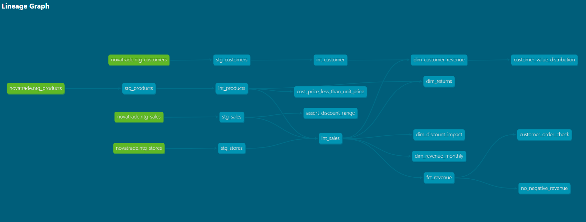

# NovaTrade dbt Project

## Overview

This dbt project transforms NovaTrade raw data into analytics-ready models for revenue, customer, product, and returns reporting. It uses a layered architecture with:

- `staging` models for source ingestion and cleaning
- `intermediate` models for business logic and feature engineering
- `marts` models for analytics-ready fact and dimension tables

## Project Objective

The goal is to convert raw transactional, customer, product, and store data into reliable, documented, and tested models that support business intelligence and analysis.

## dbt Configuration

Project configuration is in `dbt_project.yml`.

- `model-paths`: `models`
- `seed-paths`: `seeds`
- `test-paths`: `tests`
- `analysis-paths`: `analyses`
- `macro-paths`: `macros`
- `snapshot-paths`: `snapshots`

Model materializations are configured by folder:

- `staging` → `view`
- `intermediate` → `view`
- `marts` → `table`

## Project Structure

- `models/staging/`
  - `sources.yml`: source definitions and freshness configuration
  - `properties.yml`: staging model metadata and tests
  - `stg_customers.sql`
  - `stg_products.sql`
  - `stg_sales.sql`
  - `stg_stores.sql`

- `models/intermediate/`
  - `schema.yml`
  - `int_customer.sql`
  - `int_products.sql`
  - `int_sales.sql`

- `models/marts/`
  - `schema.yml`
  - `fct_revenue.sql`
  - `dim_customer_revenue.sql`
  - `dim_date.sql`
  - `dim_discount_impact.sql`
  - `dim_returns.sql`
  - `dim_revenue_monthly.sql`

- `analyses/`
  - `customers/customer_value_distribution.sql`

- `macros/`
  - `generate_schema_name.sql`

- `tests/`
  - `assert_discount_range.sql`
  - `cost_price_less_than_unit_price.sql`
  - `customer_order_check.sql`
  - `no_negative_revenue.sql`

## Key Models

### Staging

These models load the raw source tables and apply basic cleaning, casting, and field normalization.

- `stg_customers`
- `stg_products`
- `stg_sales`
- `stg_stores`

### Intermediate

These models build reusable business entities and prepare data for mart-level aggregation.

- `int_customer`
- `int_products`
- `int_sales`

### Marts

These models create analytics-ready tables for reporting:

- `fct_revenue`
- `dim_customer_revenue`
- `dim_date`
- `dim_discount_impact`
- `dim_returns`
- `dim_revenue_monthly`

## Testing

This project includes custom SQL tests covering data quality rules such as:

- discount values within expected ranges
- product unit cost relative to price
- customer order consistency
- no negative revenue values

Run tests with:

```bash
dbt test
```

## Running the Project

Build the models with:

```bash
dbt run
```

You can also compile the project without execution:

```bash
dbt compile
```

## Documentation

Generate and serve dbt documentation:

```bash
dbt docs generate
```

```bash
dbt docs serve
```

## Notes

- The dbt project is configured to use logical schemas per model folder for `staging`, `intermediate`, and `marts`.
- This project is designed to support downstream BI reporting and analysis by providing clean, consistent decision support tables.

## Lineage Graph



## Resources

- [dbt documentation](https://docs.getdbt.com/docs/introduction)
- [dbt community](https://discourse.getdbt.com/)
